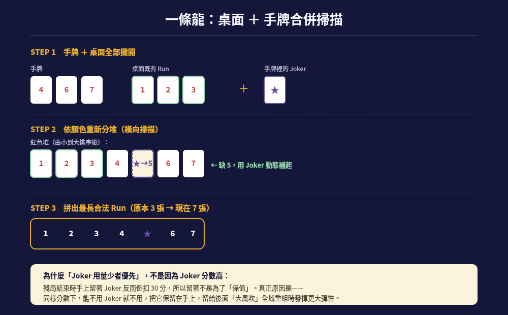

# 策略一：一條龍 —— 最長 Run 掃描

> commit 順序 #1｜對應 PPT 第 4-5 頁「Agent 決策流程」「tryInitialMeld」

## 這是什麼

拉密裡的 Run（順組）是「同色、數字連續、3 張以上」的組合。「一條龍」是這個專案裡最早成形的核心構想——與其被動地看手牌能不能剛好湊出一組，不如主動把桌面加手牌一起攤開，找出能延伸到最長的連續段，因為單看手牌很容易卡住。



## 為什麼會想到這個

最一開始的版本邏輯很單純：只要能破冰就出牌，藉此把手牌壓到最低。但實測後發現，這個策略太依賴「手牌自己剛好能湊出什麼」，牌堆快見底時常常變成雙方一直抽牌的僵局——因為只看手牌，組合空間太小。

於是把判斷範圍從「手牌自己夠不夠」擴大成「手牌 ＋ 桌面能不能拼出更長的連續段」，這就是「一條龍」這個名字的由來：像拉一條龍一樣，把同色的數字盡量串成一長條。

## 核心邏輯

```cpp
std::vector<std::vector<Tile*>> AIAgent_0::findRuns(const std::vector<Tile*>& tiles) const {
    // 1. 先把 Joker 挑出來，其餘依顏色分成四堆
    // 2. 每一堆依數字排序後，掃描找出連續的區段
    // 3. 遇到缺口，若缺口張數 <= 剩餘 Joker 數，動態借 Joker 補上
    // 4. 缺口太大則在該處斷開、收尾成一組，繼續往下掃描
}
```

掃描的判斷準則很單純：**掃得越完整、越準確，後面能組出的牌就越長**。這個函式後來也成為「大風吹」全域重組（見下一份文件）的核心掃描引擎，只是「一條龍」是最初只針對手牌的版本，「大風吹」則是把桌面也一起攤開來掃。

## Joker 的排序邏輯，容易誤解的地方

一開始會直覺覺得「長的 Run 分數通常比較高，所以要優先湊長的 Run」，但這其實是果不是因——`tryInitialMeld()` 的排序規則其實是**統一套用在所有候選組合**（不管是 Run 還是 Group）的「Joker 用量少 → 分數高」排序，沒有一條「Run 優先於 Group」的特別規則。長 Run 分數高，單純是因為分數等於牌面數字加總，剛好算出來比較高而已。

另外一個容易搞混的地方：**手上留著 Joker 不是因為它分數高、捨不得用**——事實正好相反，spec 規定殘局結束時手上剩的 Joker 要倒扣 30 分，留著其實是壞事。真正的理由是「同樣分數下，能不用 Joker 就不用，把它保留到後面『大風吹』全域重組時能發揮更大的彈性」——是保留戰術靈活度，不是因為它保值。

## 學到的事

單獨看手牌永遠是資訊不足的——桌面本身就是一個公開、可以拿來用的資源池。把「別人打出去的牌」也當作自己可以運用的素材，是這個專案從「被動出牌」轉向「主動重組」的第一個轉折點。
